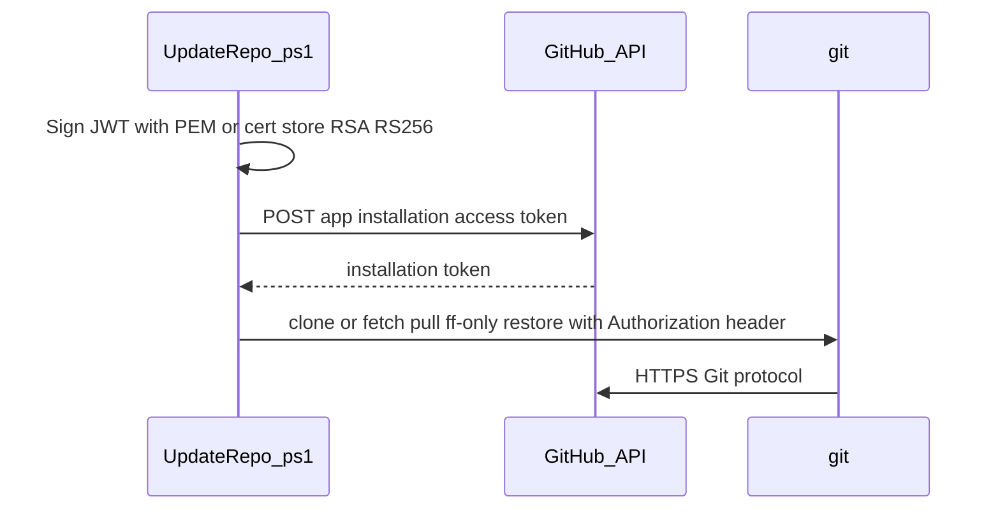

# GitHub repo sync (Windows + PowerShell)

Use a **GitHub App** to authenticate `git clone` / `git pull` on Windows servers without storing a long-lived personal access token. [`Update-Repo.ps1`](Update-Repo.ps1) mints a **short-lived installation access token** (~1 hour), then runs Git with that credential only for the current command (nothing persistently stored in the remote URL).

## Requirements

| Requirement | Notes |
|-------------|--------|
| **Windows** | Any supported Windows version where the components below run. |
| **PowerShell** | **7.4 or newer** (`pwsh`). The script uses `#requires -Version 7.4`. |
| **Git** | [Git for Windows](https://git-scm.com/download/win) — `git` must be on `PATH`. |
| **Network** | HTTPS outbound to `github.com` and `api.github.com` (and your Git host if not GitHub.com). Configure proxy if needed (see [Troubleshooting](#troubleshooting)). |
| **GitHub App** | App installed on your user/org with access to the target repo; **Contents: Read-only** is enough for pull. |
| **Private key** | Either the GitHub-generated `.pem` on disk, **or** an RSA key imported into the **Windows certificate store** (referenced by thumbprint). Not the OAuth client secret. |

## How it works



1. Load optional [`repo-sync.config.json`](repo-sync.config.json) next to the script.
2. Build a **JWT** (claims `iss` = GitHub App ID, `iat` / `exp`) signed with the **RSA private key** from a `.pem` file **or** from the **Windows certificate store** (thumbprint).
3. Call `POST /app/installations/{installation_id}/access_tokens` to get a **token**.
4. Run `git` with `http.https://github.com/.extraheader=AUTHORIZATION: Basic …` (GitHub’s recommended **x-access-token** basic pattern) so the token is not written into `origin` in `.git/config`.

## GitHub setup (one time)

1. **Create a GitHub App** (user or org): **Settings → Developer settings → GitHub Apps → New GitHub App**.
2. Under **Repository permissions**, set **Contents** to **Read-only** (read/write only if you plan to push from these servers).
3. **Generate a private key** and download the `.pem` — this file is what servers use. Store it securely; you cannot download it again later without generating a new key.
4. **Install the app** on your account or organization and choose which repositories it may access.
5. Collect:
   - **App ID** — on the app’s main settings page.
   - **Installation ID** — after install, open **Configure** for that installation. It is the number in the URL, e.g. `https://github.com/settings/installations/128286341` → installation ID `128286341`.
6. **Do not rely on Client ID / Client secret** for this script — those are for OAuth user flows. This automation uses **App ID + Installation ID + PEM**.

## Standard layout on each server

Default layout (override with parameters or config):

| Role | Path |
|------|------|
| Base directory | `C:\scripts_sync\` |
| This script + optional config | `C:\scripts_sync\` |
| Private key (restrict ACL to admins/operators) | `C:\scripts_sync\cert\<your-key>.pem` |
| Cloned repository | `C:\scripts_sync\<RepoName>\` (default repo name: `homelab`) |

The clone directory is a **sibling** of `cert\` so a pull never overwrites your bootstrap scripts or the key.

## Storing the key in the Windows certificate store (optional)

You do **not** have to keep a `.pem` file on disk. Typical approach:

1. **Bundle the GitHub private key with a certificate** so it can be imported as **PKCS#12 (PFX)**. GitHub only gives you a key; Windows expects a cert + key. A minimal **self-signed** certificate is enough (the cert is only a carrier for the key, not used for TLS).

   Using **OpenSSL** (e.g. from Git for Windows), on a **secure admin workstation**:

   ```bash
   openssl req -new -x509 -key myapp-githubsync.2026-05-04.private-key.pem -out github-app-sync.cer -days 3650 -subj "/CN=GitHub App sync (do not trust)"
   openssl pkcs12 -export -out github-app-sync.pfx -inkey myapp-githubsync.2026-05-04.private-key.pem -in github-app-sync.cer -password pass:
   ```

   Use a strong PFX password in production instead of `pass:` (empty), then pass that password when importing.

2. **Import the PFX** on the server (often requires elevation for **Local Machine**):

   ```powershell
   $pwd = Read-Host 'PFX password' -AsSecureString
   Import-PfxCertificate -FilePath .\github-app-sync.pfx -CertStoreLocation LocalMachine -CertStoreName My -Password $pwd
   ```

3. **Note the thumbprint** (ignore spaces when copying):

   ```powershell
   Get-ChildItem Cert:\LocalMachine\My | Where-Object { $_.Subject -match 'GitHub App sync' } | Format-List Subject, Thumbprint
   ```

4. **Configure the script** with `CertificateThumbprint` (and optionally store location/name). When `CertificateThumbprint` is set, **`PemPath` is not used**.

The private key material is then managed by the **CryptoAPI / CNG** store and optional **private key ACLs** (via cert mmc / `Manage Private Keys`), instead of a loose file under `C:\scripts_sync\cert`.

**Caveats**

- The account that runs **`Update-Repo.ps1`** must be allowed to use the key for signing (same as any service using a machine cert).
- **Rotation**: generate a new GitHub App key, build a new PFX, import the new cert, update **thumbprint** in config, remove the old cert from the store.

## Configuration

### `repo-sync.config.json` (optional)

If present **next to** `Update-Repo.ps1`, JSON keys override script defaults. Omitted keys keep defaults.

| Key | Description |
|-----|-------------|
| `BasePath` | Root folder (default `C:\scripts_sync`). |
| `Owner` | GitHub owner (user or org). |
| `Repo` | Repository name (without `.git`). |
| `AppId` | GitHub App numeric ID. |
| `InstallationId` | Installation ID from the installation URL. |
| `PemPath` | Full path to the `.pem` file (ignored if `CertificateThumbprint` is set). |
| `CertificateThumbprint` | Hex thumbprint of a cert in the store that has the **RSA private key** (no spaces required). When set, PEM file is not used. |
| `CertificateStoreLocation` | `LocalMachine` or `CurrentUser` (default `LocalMachine`). |
| `CertificateStoreName` | Store name (default `My` = *Personal*). |
| `ClonePath` | Full path to the git working copy (optional if default `BasePath\Repo` is correct). |

Example (adjust for your environment):

```json
{
  "BasePath": "C:\\scripts_sync",
  "Owner": "your-github-user-or-org",
  "Repo": "your-repo",
  "AppId": "1234567",
  "InstallationId": "12345678"
}
```

Use **double backslashes** in JSON paths on Windows.

### Script parameters

All can be passed on the command line. **`repo-sync.config.json` overwrites** any matching parameter (including values you passed on the command line) when those JSON keys are present—omit a key from JSON if you want only CLI/default behavior.

| Parameter | Purpose |
|-----------|---------|
| `BasePath` | Sync root (default `C:\scripts_sync`). |
| `Owner`, `Repo` | Repository slug `Owner/Repo`. |
| `AppId`, `InstallationId` | GitHub App identifiers. |
| `PemPath` | Full path to `.pem`. Default when no thumbprint: `BasePath\cert\myapp-githubsync.2026-05-04.private-key.pem`. |
| `CertificateThumbprint` | Use cert store instead of PEM (see [Storing the key in the Windows certificate store](#storing-the-key-in-the-windows-certificate-store-optional)). |
| `CertificateStoreLocation` | `LocalMachine` or `CurrentUser`. |
| `CertificateStoreName` | Usually `My`. |
| `ClonePath` | Git working tree path. Default: `BasePath\<Repo>`. |
| `ConfigPath` | Alternate JSON config file path. |

Either set **`CertificateThumbprint`** *or* rely on **`PemPath`** (default path if omitted).

## Usage examples

From the directory that contains the script:

```powershell
pwsh -File .\Update-Repo.ps1
```

Explicit config file:

```powershell
pwsh -File .\Update-Repo.ps1 -ConfigPath 'D:\sync\repo-sync.config.json'
```

Override owner/repo for a one-off test:

```powershell
pwsh -File .\Update-Repo.ps1 -Owner 'myorg' -Repo 'other-repo' -ClonePath 'C:\scripts_sync\other-repo'
```

Use a **certificate thumbprint** instead of a PEM file:

```powershell
pwsh -File .\Update-Repo.ps1 -CertificateThumbprint 'A1B2C3D4E5F6...'
```

After first clone, later runs perform `git fetch`, `git pull --ff-only` (fast-forward only), then `git restore` so deleted or modified **tracked** files are put back to match the latest commit. Untracked files you added locally are left alone. If the server has local commits or diverged branches, the pull may fail until you reset or merge intentionally—by design.

## Adding a new server (checklist)

1. Install **PowerShell 7.4+** and **Git for Windows**.
2. Create folders: `C:\scripts_sync\` and `C:\scripts_sync\cert\`.
3. Copy **`Update-Repo.ps1`** and optionally **`repo-sync.config.json`** to `C:\scripts_sync\`.
4. Provide signing material **either**: copy the **`.pem`** (restrict NTFS on `cert\`), **or** import the **PFX** into `LocalMachine\My` (or `CurrentUser\My`) and set **`CertificateThumbprint`** in config—no loose PEM needed on disk after import.
5. Ensure outbound HTTPS to GitHub (firewall/proxy).
6. Run:

   ```powershell
   pwsh -File C:\scripts_sync\Update-Repo.ps1
   ```

No extra registration step exists in GitHub for “this machine”—each server uses the same app credentials you already configured.

## Security practices

- **Never commit** the `.pem` to git. This repo’s [`.gitignore`](.gitignore) ignores `*.pem` and `repo-sync.local.json`; keep keys out of history.
- **Client secret** (OAuth) is not used by this script; rotate it if it was exposed, but it does not grant `git` access for this flow.
- **Rotate** the app private key in GitHub by generating a new key, distributing the new `.pem` to all servers, then revoking the old key in the app settings.
- Prefer running from **`C:\scripts_sync`** (machine-wide) rather than a user profile so scheduled tasks or different operators behave consistently.

## Troubleshooting

| Issue | What to check |
|-------|----------------|
| **Private key not found** | PEM: `PemPath` / default under `cert\`. **Cert**: thumbprint typo, wrong store (`LocalMachine` vs `CurrentUser`), or cert imported without private key. |
| **Certificate does not have an RSA private key** | Wrong certificate selected, or PFX imported as **public only**. Re-import with full key. |
| **Installation token request failed** | Clock skew (sync time), wrong **Installation ID** or **App ID**, PEM not matching the app, or app not installed on that repo/org. |
| **401 / 403 from API** | App permissions (Contents), repo not granted on the installation, or revoked key. |
| **git SSL / proxy errors** | Corporate TLS inspection: install your root CA for Git; set `http.proxy` / system proxy as required. |
| **pull --ff-only fails** | Local changes or non-FF history; resolve in the clone directory or re-clone to a new path (after backup). |

## Files in this folder

| File | Purpose |
|------|---------|
| `Update-Repo.ps1` | Main entry script. |
| `repo-sync.config.json` | Optional defaults (safe to customize per environment). |
| `.gitignore` | Prevents committing keys and local overrides. |

## License / scope

This tooling is a small operational helper. Adapt paths, repo names, and GitHub App IDs to your environment; keep secrets on disk with strict ACLs, not in shared source control.
